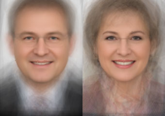

# Average faces with OpenCV (Python)

Calculate the image of an average face from multiple images using the machine learning library [dlib](http://dlib.net/) and the computer vision toolkit [OpenCV](https://opencv.org/). For this example, we'll use images of Bavarian politicians.



## Data

I put together a list of all members of the Bavarian parliament, which I scraped from their [website](https://www.bayern.landtag.de/politicians/politicians-von-a-z/). The dataset contains unique IDs which we'll use to download the image of each politician.

Here the first five entries from `data/politicians.csv`:

```
id,forename,name,title,party,gender
555500000394,Klaus,Adelt,,SPD,M
555500002811,Ilse,Aigner,,CSU,W
555500000369,Hubert,Aiwanger,,Freie Wähler,M
555500000366,Horst,Arnold,,SPD,M
555500000341,Inge,Aures,Dipl.-Ingenieurin (FH); M.A.,SPD,W
```

## Requirements

Python 2 is required for running the scripts, though it might work with Python 3 as well.

Dlib, which we'll use for landmark extraction, requires CMake to build:

```
$ brew install cmake
```

I've tested the scripts on a Mac running High Sierra (10.13). Linux users might need to change a few commands (like `apt-get install`) to set up their system and get the code to run.

## Setup

Create a new virtual environment:

```
$ virtualenv venv
```

Activate the virtual environment:

```
$ source venv/bin/activate
```

Check if the Python virtual environment is set up correctly:

```
$ which python
/Users/your-username/Development/venv/env/bin/python
```

Install dependencies:

```
$ pip install -r requirements.txt
```

## Download images

*If you already have your own set of images, you can skip this step.*

Run the script proving a path to where the images should be downloaded. If the folder does not exist, it will be created for your convenience:

```
$ python download.py ./images
```

To download the images needed for averaging, the script stitches together an image URL using the base URL and the ID of each politician from the CSV file `data/politicians.csv`.

```
"https://www.bayern.landtag.de/images/politicians/" + "555500000394" + ".jpg"
```

## Extract face landmarks

The script tries to find human faces in an image and extract 68 landmarks. These are points on the face such as the corners of the mouth, along the eyebrows, on the eyes, and so forth. We'll need this landmarks to map the different faces onto each other.

The script needs a pre-trained model for predicting these features, which is available for download (~ 60 MB):

```
$ wget http://dlib.net/files/shape_predictor_68_face_landmarks.dat.bz2
```

Unzip the shape predictor (~ 95 MB):

```
$ bzip2 -dk shape_predictor_68_face_landmarks.dat.bz2
```

```
$ python extract.py shape_predictor_68_face_landmarks.dat ./images
```

The extracted landmarks will be saved as list of xy coordinates in the same folder as the images, using a ".txt" extension.

## Average faces

```
w = 340;
h = 480;
```

## References

One Millisecond Face Alignment with an Ensemble of Regression Trees by
Vahid Kazemi and Josephine Sullivan, CVPR 2014
and was trained on the iBUG 300-W face landmark dataset (see
https://ibug.doc.ic.ac.uk/resources/facial-point-annotations/):  
     
C. Sagonas, E. Antonakos, G, Tzimiropoulos, S. Zafeiriou, M. Pantic. 
300 faces In-the-wild challenge: Database and results. 
Image and Vision Computing (IMAVIS), Special Issue on Facial Landmark Localisation "In-The-Wild". 2016.

## Improvements